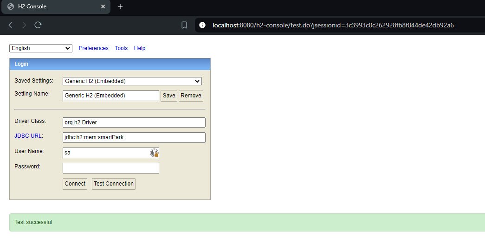
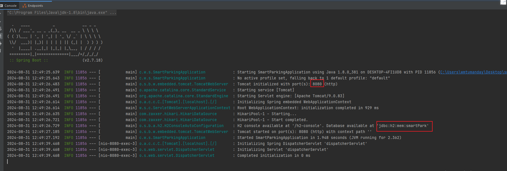
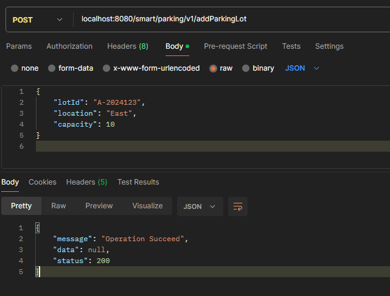
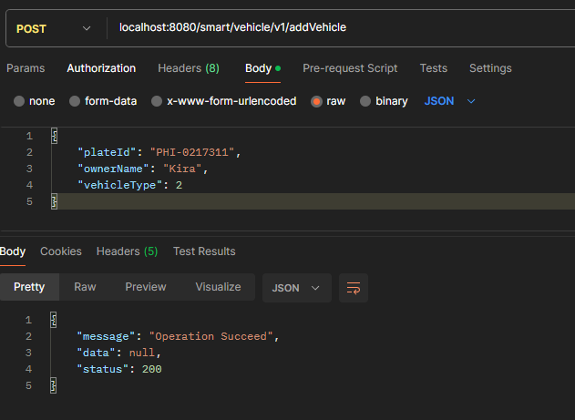
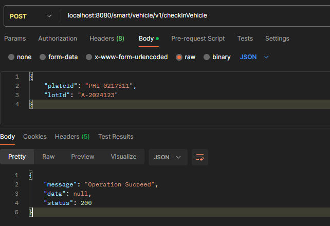
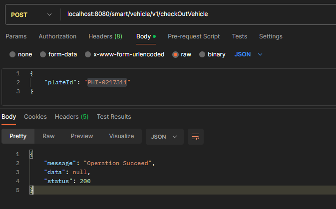
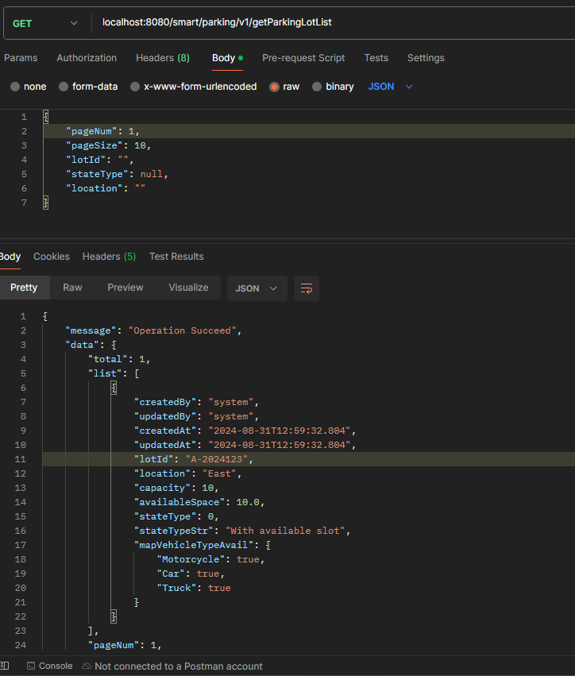
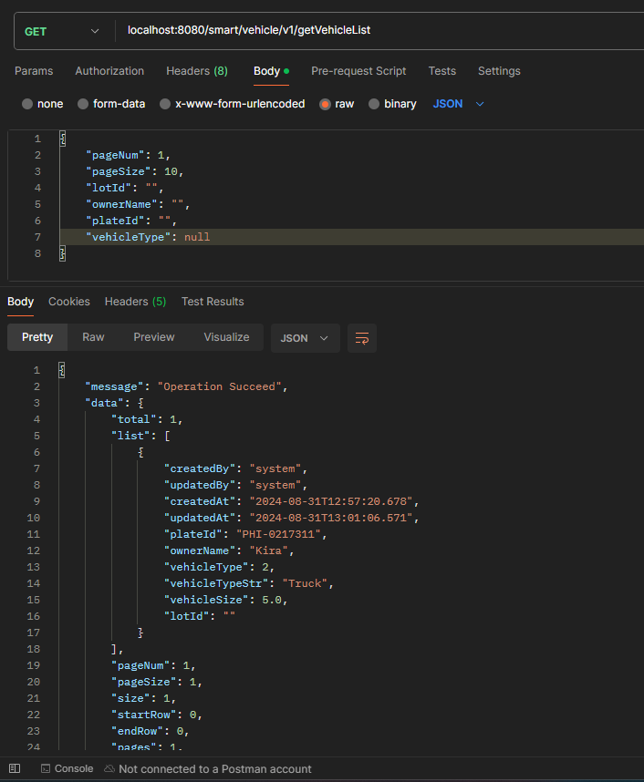

# smart-parking
"SmartPark" is a technology company developing an intelligent parking management system for urban areas. The company is aiming to optimize the use of parking spaces and facilitate easy navigation for drivers.

The service should be capable of doing,

• Registering a parking lot

• Registering a vehicle

• Checking in a vehicle to a parking lot

• Checking out a vehicle from a parking lot

• Viewing current occupancy and availability of a parking lot

• Viewing all vehicles currently parked in a lot

BUILD INSTRUCTIONS
JRE : 1.8
run (localhost:8080) com.wmt.smartparking.SmartParkingApplication
H2 : jdbc:h2:mem:smartPark

==================================================================================

# Registering a parking lot

lotId: Required / 50 characters max

location: Required / 100 characters max

capacity: Required

----------------------------------------------------------------
curl --location 'localhost:8080/smart/parking/v1/addParkingLot' \
--header 'Content-Type: application/json' \
--data '{
"lotId": "A-2024123",
"location": "East",
"capacity": 10
}'
----------------------------------------------------------------
Request body sample:

{
"lotId": "A-2024123",
"location": "East",
"capacity": 10
}
----------------------------------------------------------------

==================================================================================

# Registering a vehicle

plateId: Required / 20 characters max

ownerName: Required / 50 characters max

vehicleType: Required / select specific type obtain from /v1/getVehicleTypeMap response data

----------------------------------------------------------------
curl --location 'localhost:8080/smart/vehicle/v1/addVehicle' \
--header 'Content-Type: application/json' \
--data '{
"plateId": "PHI-0217311",
"ownerName": "Kira",
"vehicleType": 2
}'
----------------------------------------------------------------
Request body sample:

{
"plateId": "PHI-0217311",
"ownerName": "Kira",
"vehicleType": 2
}
----------------------------------------------------------------

==================================================================================

# Get collections of vehicle type (Use for dropdown vehicle type selection)

curl --location --request GET 'localhost:8080/smart/vehicle/v1/getVehicleTypeMap' \
--header 'Content-Type: application/json' \
--data '{}'
----------------------------------------------------------------
Request body sample: {}

----------------------------------------------------------------

==================================================================================

# Checking in a vehicle to a parking lot

plateId: Required

lotId: Required / select available lotId from parking lot list which stateStr = "With available slot" or in mapVehicleTypeAvail collection the value of vehicle type is "true".

----------------------------------------------------------------
curl --location 'localhost:8080/smart/vehicle/v1/checkInVehicle' \
--header 'Content-Type: application/json' \
--data '{
"plateId": "PHI-0217311",
"lotId": "A-2024123"
}'
----------------------------------------------------------------
Request body sample:

{
"plateId": "PHI-0217311",
"lotId": "A-2024123"
}
----------------------------------------------------------------

==================================================================================

# Checking out a vehicle from a parking lot

plateId: Required

----------------------------------------------------------------
curl --location 'localhost:8080/smart/vehicle/v1/checkOutVehicle' \
--header 'Content-Type: application/json' \
--data '{
"plateId": "PHI-0217311"
}'
----------------------------------------------------------------
Request body sample:

{
"plateId": "PHI-0217311"
}
----------------------------------------------------------------

==================================================================================

# Viewing current occupancy and availability of a parking lot

pageNum: Required

pageSize: Required

lotId: Optional depending on usage or porpuse (filter list by lotId)

stateType: Optional depending on usage or porpuse (filter list by stateType 0 = avail or 1 = occupied)

location: Optional depending on usage or porpuse (filter list by location)

----------------------------------------------------------------
curl --location --request GET 'localhost:8080/smart/parking/v1/getParkingLotList' \
--header 'Content-Type: application/json' \
--data '{
"pageNum": 1,
"pageSize": 10,
"lotId": "",
"stateType": null,
"location": ""
}'
----------------------------------------------------------------
Request body sample:

{
"pageNum": 1,
"pageSize": 10,
"lotId": "",
"stateType": null,
"location": ""
}
----------------------------------------------------------------
Response body sample:

{
"message": "Operation Succeed",
"data": {
"total": 3,
"list": [
{
"createdBy": "system",
"updatedBy": "system",
"createdAt": "2024-08-31T11:40:20.24",
"updatedAt": "2024-08-31T12:10:02.613",
"lotId": "A-2024123",
"location": "East",
"capacity": 10,
"availableSpace": 5.0,
"stateType": 1,
"stateTypeStr": "Fully occupied",
"mapVehicleTypeAvail": {
"Motorcycle": true,
"Car": true,
"Truck": true
}
},
{
"createdBy": "system",
"updatedBy": "system",
"createdAt": "2024-08-31T12:08:51.056",
"updatedAt": "2024-08-31T12:10:02.613",
"lotId": "A-2024121",
"location": "South",
"capacity": 1,
"availableSpace": 0.0,
"stateType": 1,
"stateTypeStr": "Fully occupied",
"mapVehicleTypeAvail": {
"Motorcycle": false,
"Car": false,
"Truck": false
}
},
{
"createdBy": "system",
"updatedBy": "system",
"createdAt": "2024-08-31T12:10:34.838",
"updatedAt": "2024-08-31T12:10:34.838",
"lotId": "A-2024129",
"location": "North",
"capacity": 1,
"availableSpace": 1.0,
"stateType": 0,
"stateTypeStr": "With available slot",
"mapVehicleTypeAvail": {
"Motorcycle": true,
"Car": true,
"Truck": false
}
}
],
"pageNum": 1,
"pageSize": 3,
"size": 3,
"startRow": 0,
"endRow": 2,
"pages": 1,
"prePage": 0,
"nextPage": 0,
"isFirstPage": true,
"isLastPage": true,
"hasPreviousPage": false,
"hasNextPage": false,
"navigatePages": 8,
"navigatepageNums": [
1
],
"navigateFirstPage": 1,
"navigateLastPage": 1
},
"status": 200
}
----------------------------------------------------------------

==================================================================================

# Viewing all vehicles currently parked in a lot

pageNum: Required

pageSize: Required

lotId: Optional depending on usage or porpuse (filter list by lotId)

ownerName: Optional depending on usage or porpuse (filter list by ownerName)

plateId: Optional depending on usage or porpuse (filter list by plateId)

vehicleType: Optional depending on usage or porpuse (filter list by vehicleType)

----------------------------------------------------------------
curl --location --request GET 'localhost:8080/smart/vehicle/v1/getVehicleList' \
--header 'Content-Type: application/json' \
--data '{
"pageNum": 1,
"pageSize": 10,
"lotId": "A-2024123",
"ownerName": "",
"plateId": "",
"vehicleType": null
}'
----------------------------------------------------------------
Request body sample:

{
"pageNum": 1,
"pageSize": 10,
"lotId": "A-2024123",
"ownerName": "",
"plateId": "",
"vehicleType": null
}
----------------------------------------------------------------
Response body sample:

{
"message": "Operation Succeed",
"data": {
"total": 2,
"list": [
{
"createdBy": "system",
"updatedBy": "system",
"createdAt": "2024-08-31T12:22:35.353",
"updatedAt": "2024-08-31T12:25:27.778",
"plateId": "PHI-0956595",
"ownerName": "Kira",
"vehicleType": 1,
"vehicleTypeStr": "Car",
"vehicleSize": 1.0,
"lotId": "A-2024123"
},
{
"createdBy": "system",
"updatedBy": "system",
"createdAt": "2024-08-31T11:43:57.971",
"updatedAt": "2024-08-31T11:53:40.723",
"plateId": "PHI-0217310",
"ownerName": "Wil",
"vehicleType": 2,
"vehicleTypeStr": "Truck",
"vehicleSize": 5.0,
"lotId": "A-2024123"
}
],
"pageNum": 1,
"pageSize": 2,
"size": 2,
"startRow": 0,
"endRow": 1,
"pages": 1,
"prePage": 0,
"nextPage": 0,
"isFirstPage": true,
"isLastPage": true,
"hasPreviousPage": false,
"hasNextPage": false,
"navigatePages": 8,
"navigatepageNums": [
1
],
"navigateFirstPage": 1,
"navigateLastPage": 1
},
"status": 200
}
----------------------------------------------------------------
